# ARGOS-Labs POT SDK2 on Windows, Linux, Mac

Welcome to the Python-to-Operation Toolset (POT) SDK2 for ARGOS Low-code platform. This document will show you how to develop and release a plugin from your Python solution. 

> * Unless otherwise noted, it applies to Windows, Linux, and Mac.
> * Provide separate explanations for each operating system if necessary.

## Setting up the Development Environment
First, the new POT-SDK2 is installed using [uv](https://docs.astral.sh/uv/). The following explains the advantages of using uv.

### Highlights
* 🚀 A single tool to replace pip, pip-tools, pipx, poetry, pyenv, twine, virtualenv, and more.
* ⚡️ 10-100x faster than pip.
* 🗂️ Provides comprehensive project management, with a universal lockfile.
* ❇️ Runs scripts, with support for inline dependency metadata.
* 🐍 Installs and manages Python versions.
* 🛠️ Runs and installs tools published as Python packages.
* 🔩 Includes a pip-compatible interface for a performance boost with a familiar CLI.
* 🏢 Supports Cargo-style workspaces for scalable projects.
* 💾 Disk-space efficient, with a global cache for dependency deduplication.
* ⏬ Installable without Rust or Python via curl or pip.
* 🖥️ Supports macOS, Linux, and Windows.

### How to install uv

> Refer to [Installation](https://docs.astral.sh/uv/getting-started/installation/) in the uv documentation.

#### Windows

Run the command window (CMD.exe) and enter the following command.

```bash
powershell -ExecutionPolicy ByPass -c "irm https://astral.sh/uv/install.ps1 | iex"
```

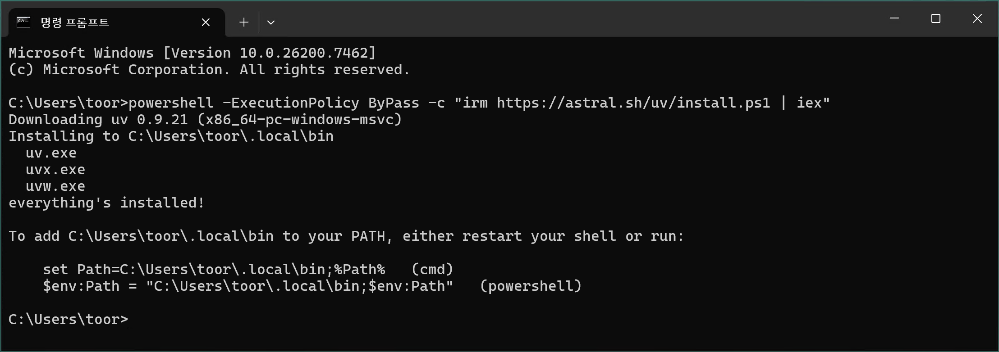

> After installation, the uv command may not be applied immediately; you may need to open a new command window to see it applied.

#### Linux, Mac

Run the terminal and enter the following command.

```bash
curl -LsSf https://astral.sh/uv/install.sh | sh
```

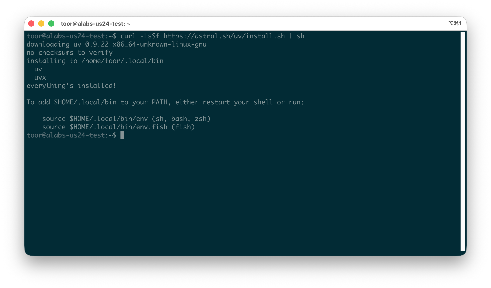

> After installation, the uv command may not be applied immediately; you may need to open a new terminal to see it applied.

### Python Installation
The default Python interpreter where POT-SDK2 currently runs is set to 3.11.

Install version 3.11 using uv.

```bash
uv python install 3.11
```

Check the installed Python interpreter as follows.

```bash
uv python list
```

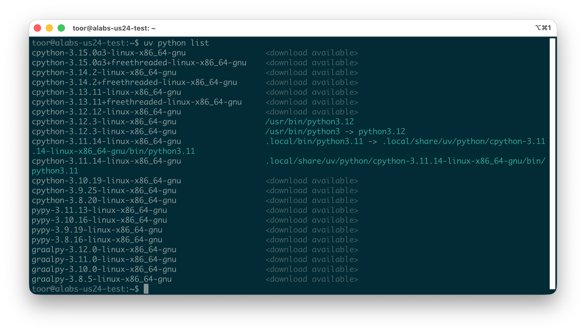

> You can install any Python version you want, such as `uv python install 3.13`.


### POT-SDK2 Installation

Install POT-SDK2 using the uv tool.

#### Installing alabs.ppm2

```bash
uv tool install --python 3.11 --extra-index-url https://pypi-official.argos-labs.com/simple --index-strategy unsafe-best-match alabs.ppm2
```
> If you want to upgrade the installed alabs.ppm2 tool, use `upgrade` instead of `install` in the command above.

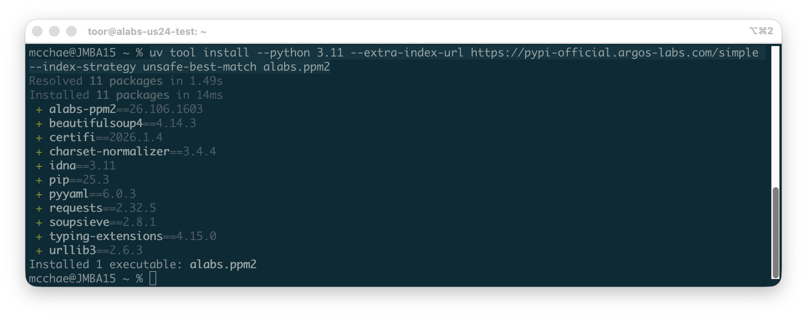


#### Installing alabs.icon2

```bash
uv tool install --python 3.11 --extra-index-url https://pypi-official.argos-labs.com/simple --index-strategy unsafe-best-match alabs.icon2
```
> If you want to upgrade the installed alabs.icon2 tool, use `upgrade` instead of `install` in the command above.

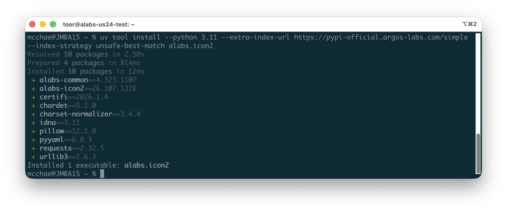


#### Verify Installation

```bash
uv tool list --show-python
```

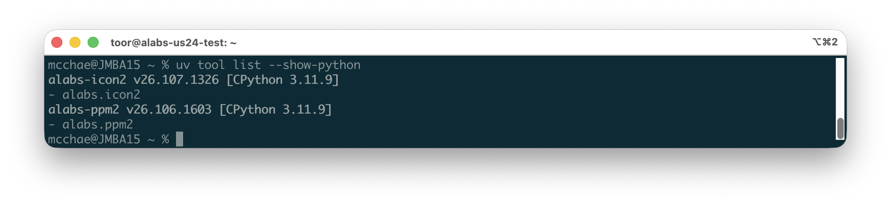

> Caution! The Python version must be 3.11.x, meaning it must be installed as 3.11.


### IDE Installation

In previous documents, PyCharm was used as the integrated development environment, but in this version, Visual Studio Code is used.

> Both Google's `Antigravity` or CursorAI's `Cursor` are based on Visual Studio Code, so they work the same way.
> The examples in this document are written based on `Antigravity`.

Install an IDE from the Visual Studio Code family.

## Download Template

* Download [plugin-template2.zip](./plugin-template2.zip) and extract it in your workspace.
* Assume it is extracted to `~/home/user~/work/plugin-template2`.

## Plugin Development, Debugging, Testing and Building

### Run IDE
* Run the IDE.
* Use the `Folder Open` menu to open the extracted plugin-template2 folder.

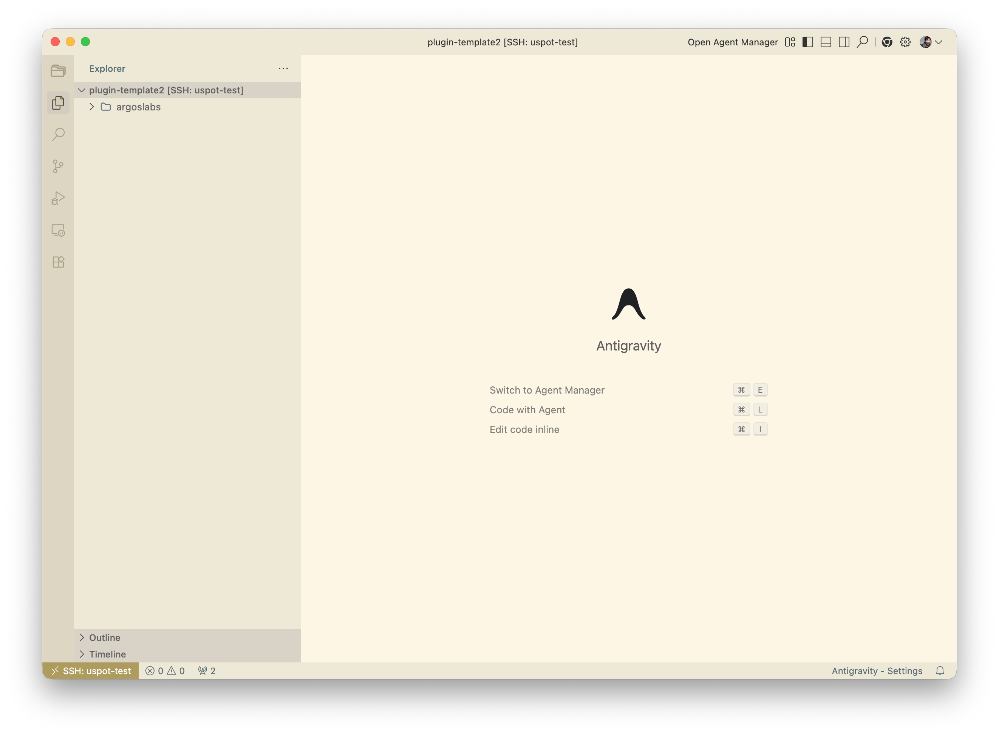

### Install Python Extension
* You need to install the `Python Extension` for Python development and debugging.

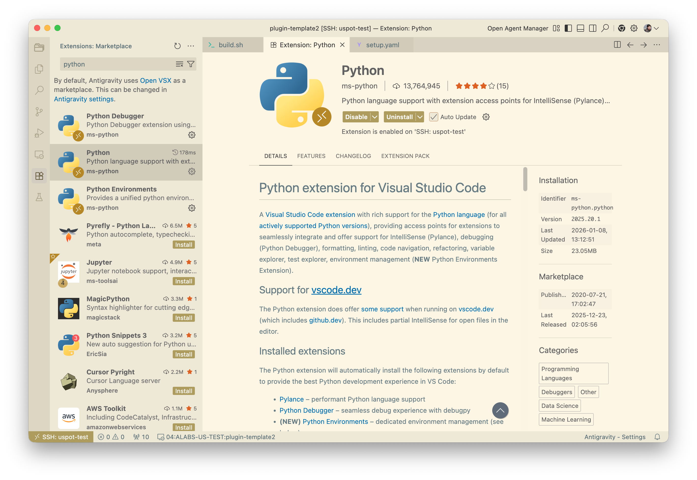

### Build Python Virtual Environment
* Building a Python virtual environment: Build a virtual environment with the Python version you want to develop with.

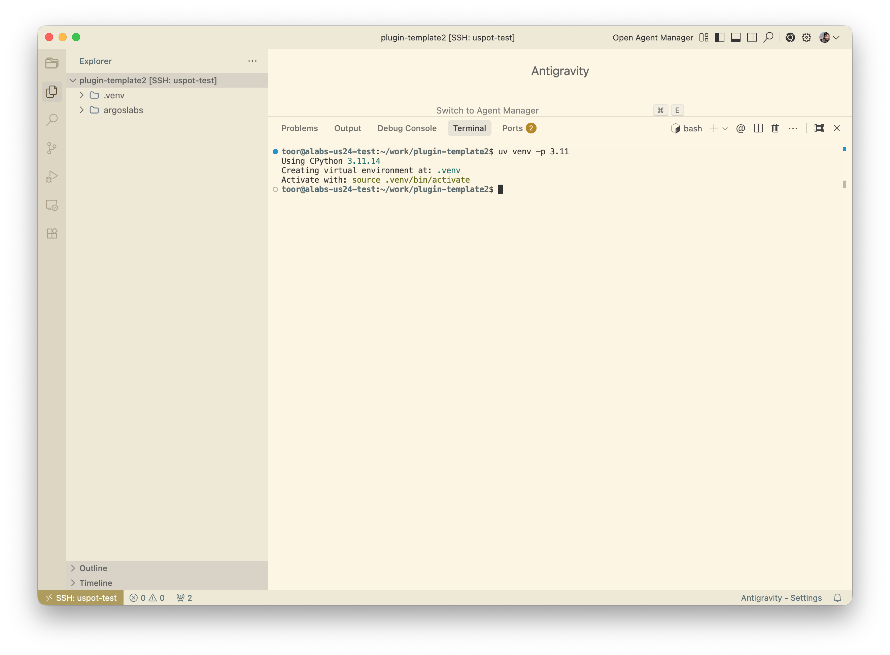

> * Press `Control+J` (Windows, Linux) or `Command+J` (Mac) in the IDE to run the terminal.
> * Run the command `uv venv -p 3.11` in the top-level folder (`~/home/user~/work/plugin-template2`).
> * You can use any Python version you want instead of 3.11. (3.8 or higher)

### Set Python Interpreter in IDE

* Use the `Python: Select Interpreter` menu in the IDE to set the Python interpreter.
* On Linux or Mac, select `./.venv/bin/python`. 
* On Windows, select `.\.venv\Scripts\python.exe`. 

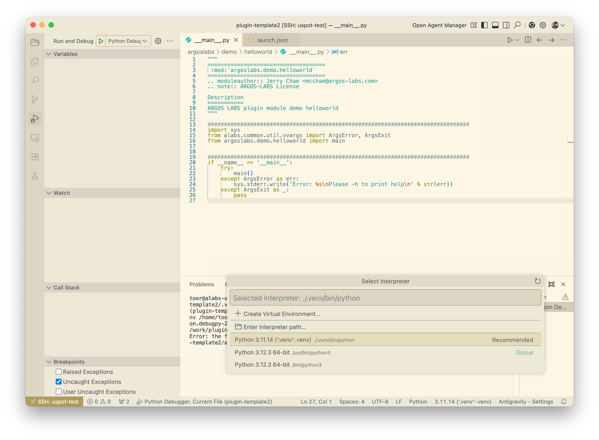

> * Looking at the bottom right, you can see `Python 3.11.x ('.venv': venv)`, indicating that the current Python interpreter is a virtual environment.


### Install Necessary Packages

* After running the terminal in the IDE, enter the location of `__init__.py` where the plugin's main source is located.
* In the template example, enter `argoslabs/demo/helloworld`.
* On Linux or Mac, run the command `bash requirements.sh`.
* On Windows, run the command `requirements.bat`.

> Specify and install the external Python packages required for plugin development in the `requirements.txt` file.

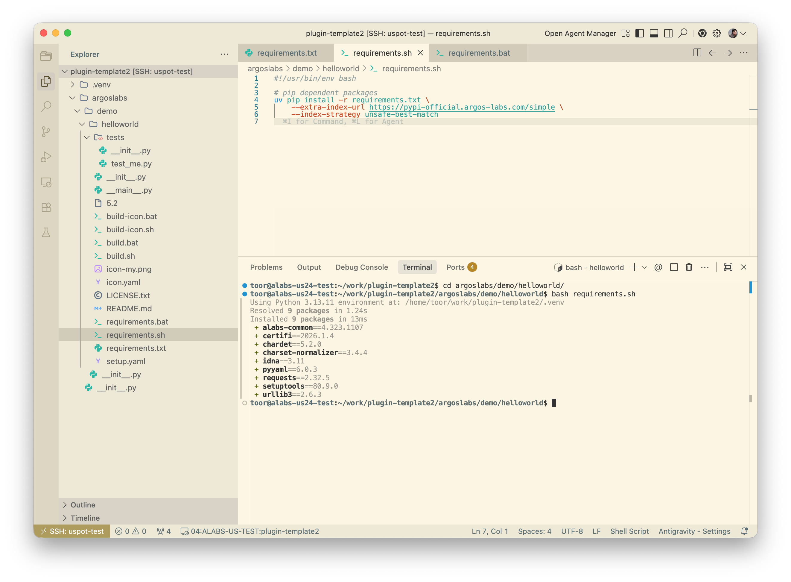

### Debugging

#### Create or Modify launch.json

* Select the `Run and Debug` icon on the left of the IDE and select `create a launch.json file`.
* Select `Python Debugger` and then select `Python File Debug the current active Python file`.
* Then, check the resulting `launch.json` file and change it as follows.

```json
{
    "version": "0.2.0",
    "configurations": [
        {
            "name": "Python: Current File",
            "type": "python",
            "request": "launch",
            "program": "${file}",
            "args": ["Tom", "Jerry"],
            "cwd": "${fileDirname}",
            "env": {
                "PYTHONPATH": "${workspaceFolder}",
            },
            "console": "integratedTerminal"
        }
    ]
}
```

> * `args` specifies the arguments to be passed to the Python file to be executed. For demo purposes, `Tom` and `Jerry` were specified. Specify as needed. 
> * `cwd` specifies the current working directory of the Python file to be executed.
> * `env` specifies the environment variables for the Python file to be executed. `PYTHONPATH` was specified to find the `argoslabs...` package.

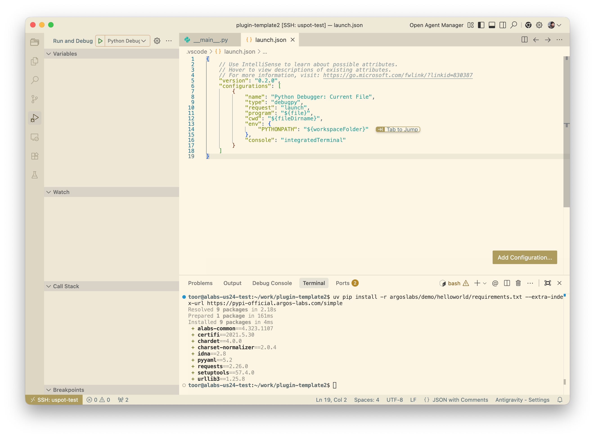  

#### Run Debugging

* Open the `__init__.py` file containing the actual plugin logic and press `F9` to set a breakpoint. (In the demo, it is the `__init__.py` file in `argoslabs/demo/helloworld`.)
* Open the `__main__.py` file in the same folder and press `F5` to run.
* Then, you can debug the `__init__.py` file where the breakpoint is set as follows.

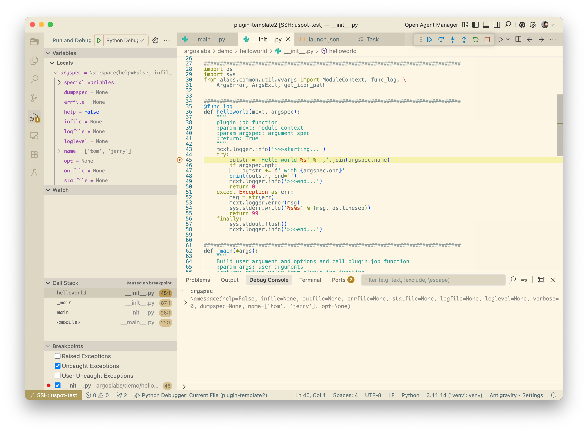

### Testing

* Open the `test_me.py` test file in the `tests` folder of `__init__.py` where the main logic is located.
* The test file performs unit testing using Python's `unittest` functionality.
* Press `F5` to perform the test.
* Perform tests by adding success as well as failure cases thoroughly.

> If the test is performed, it will stop at the same build process that will follow, so you must perform the test successfully in this process.

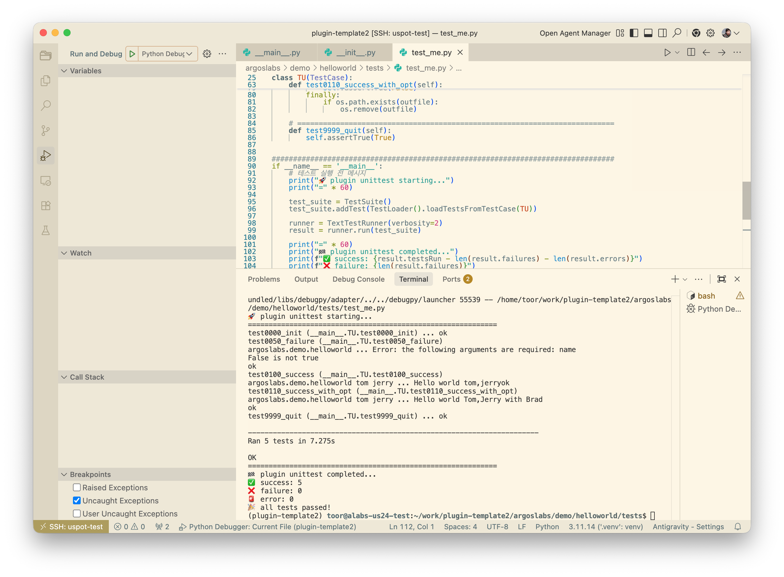

### Check Icon and Version

#### Prepare Icon

* Check the `icon-my.png` file in the work folder.

> In reality, unlike the demo, prepare and use an appropriate icon to be displayed on STU.

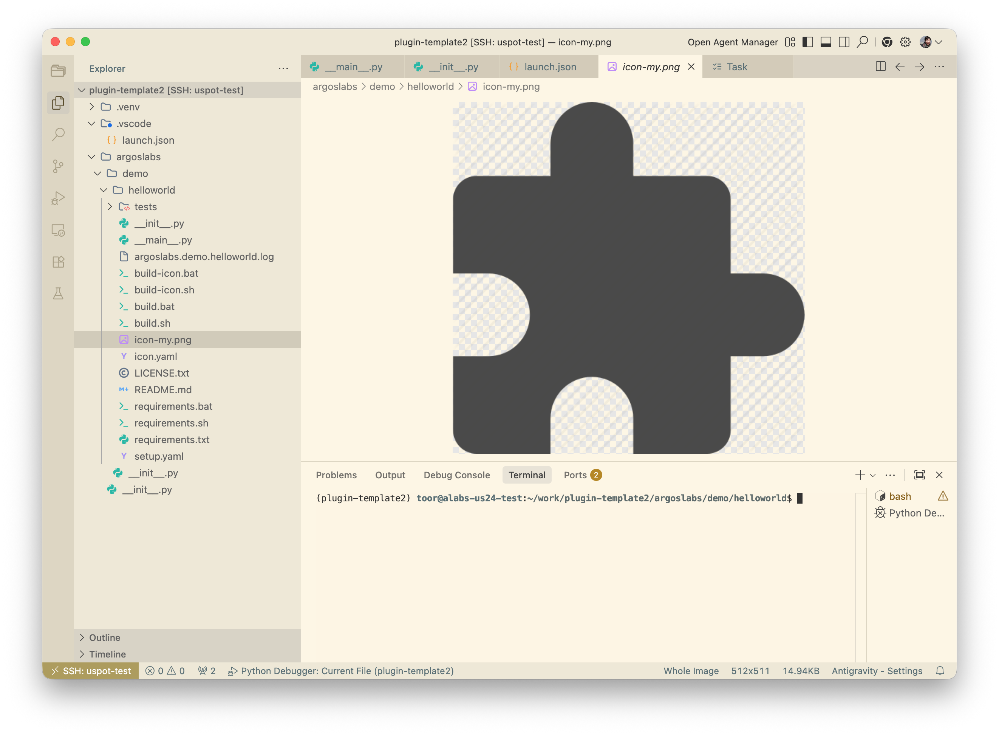

#### Generate Icon for STU

* On Linux or Mac, run the command `bash build-icon.sh`.
* On Windows, run the command `build-icon.bat`.

 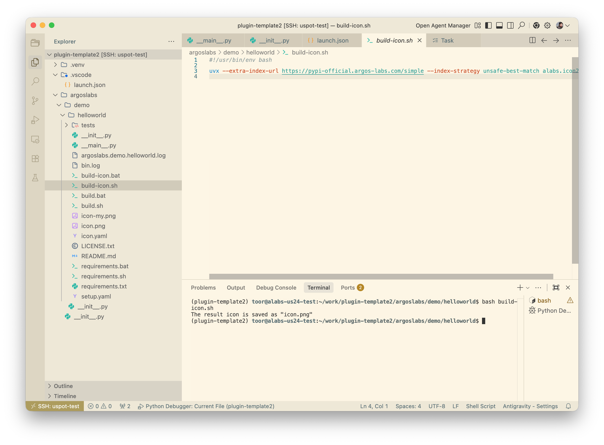

Then you can find the resulting `icon.png` file as follows.

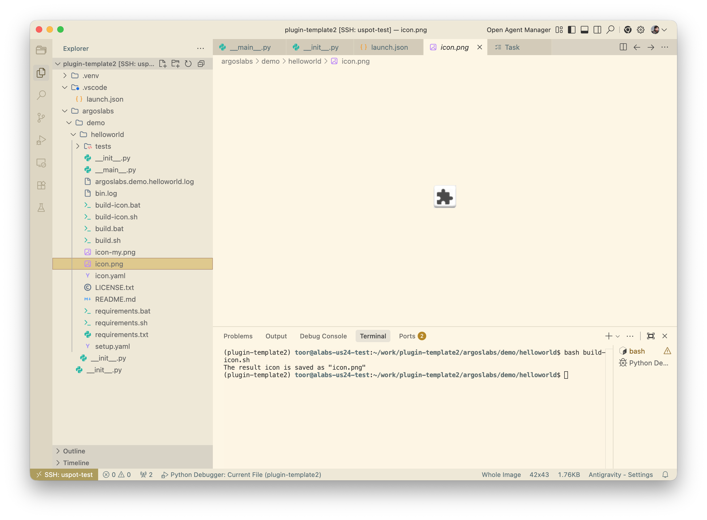

#### Check Version

* Check and modify the `version` part in `setup.yaml`.
* We recommend a version in the following format. 
  * If the current time is January 9, 2026, 11:34 AM, set it to `2026.109.1134`.


### Build

#### Check Python Version for Build

* On Linux or Mac, open the `build.sh` file.
* On Windows, open the `build.bat` file.
* Check and modify the `PYVER=3.11` part.
*   > You must use the same Python version you used when you first created the virtual environment.
*   > For example, if the Python version used when creating the virtual environment with the `uv venv -p 3.13` command was 3.13, set `PYVER=3.13`. 

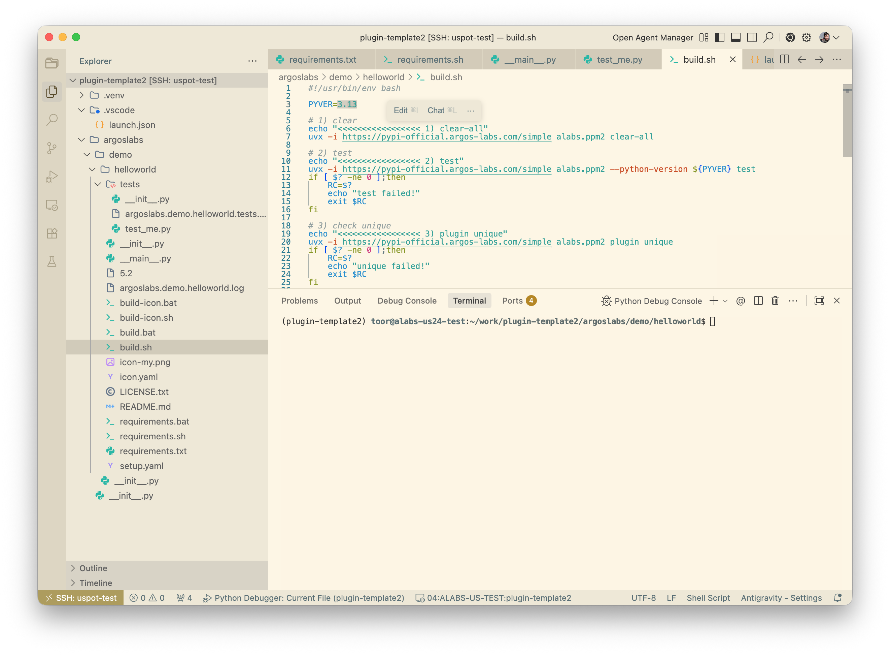

#### Run Build

* On Linux or Mac, run the command `bash build.sh`.
* On Windows, run the command `build.bat`.

The build process is as follows.

* `clear-all`: Deletes all previously created virtual environments for build. (`~/.alabs-ppm2/pot-venvs` folder)
* `test`: Create a dedicated virtual environment for build in a place like `~/.alabs-ppm2/pot-venvs/3.x`, install the necessary `requirements.txt` packages, and then perform the `tests\test_me.py` test.
* `plugin unique`: Check whether a plugin of the same version is already installed in a private repository or official repository (`https://pypi-official.argos-labs.com`). If it exists, stop the build.
* `build`: Build the plugin using the same virtual environment for build (`~/.alabs-ppm2/pot-venvs/3.x`).
* `upload`: Upload the built plugin to the private repository.

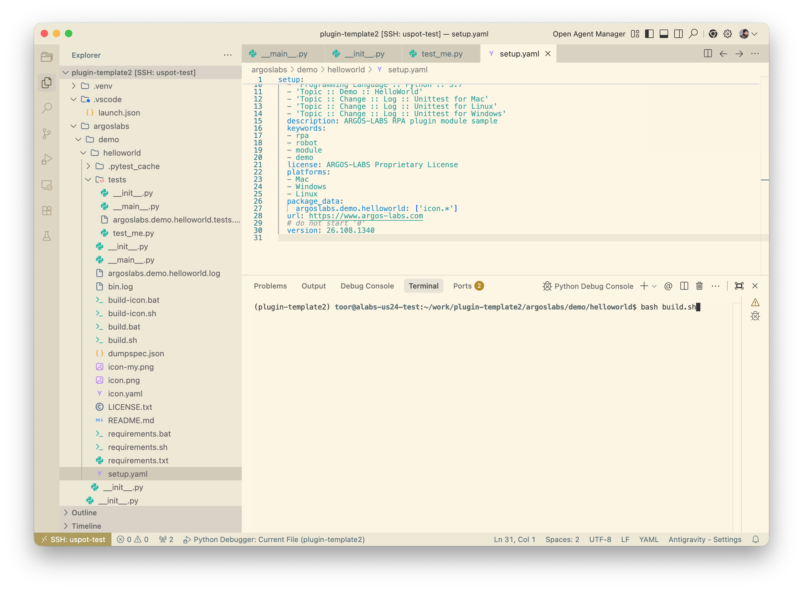

> * It will ask for the supervisor's account and password in the research whether the same version of the plugin with the same name is already installed (`plugin uniquey`) and the upload part to the private repository.

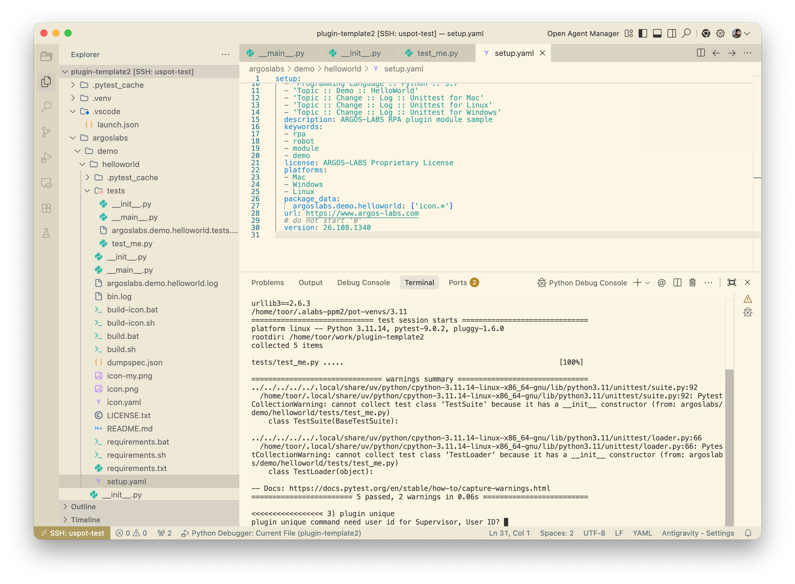

> If all builds are successfully performed, the following `Build all success!` message will appear.

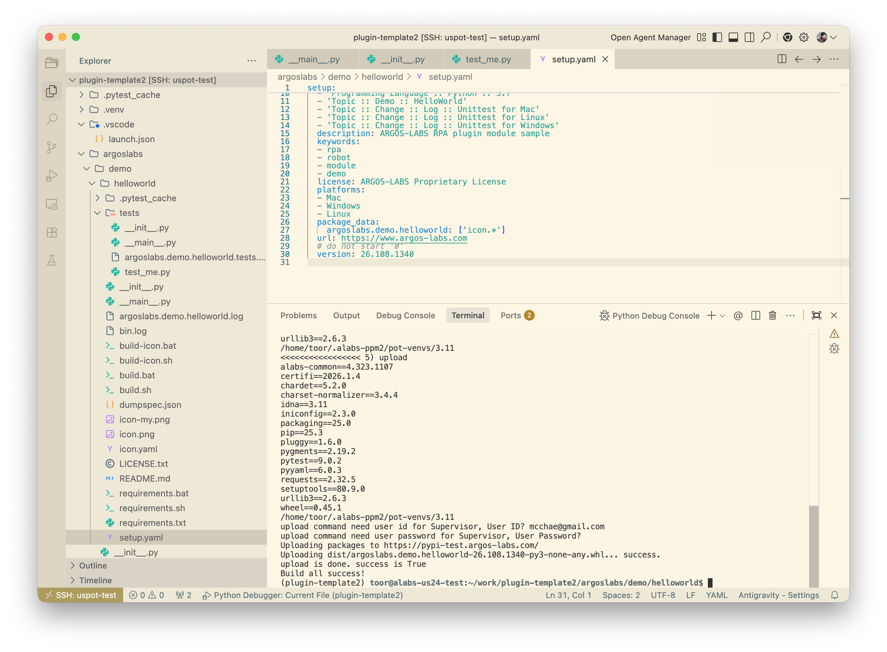

## Writing Your Own Plugin

* The plugin package name of the `plugin-template2` template is `argoslabs.demo.helloworld`.
* If you want to change this plugin to `argoslabs.my.plugin`, for example, use the `Code Search` tool on the left of the IDE to change the package name in all files as follows.

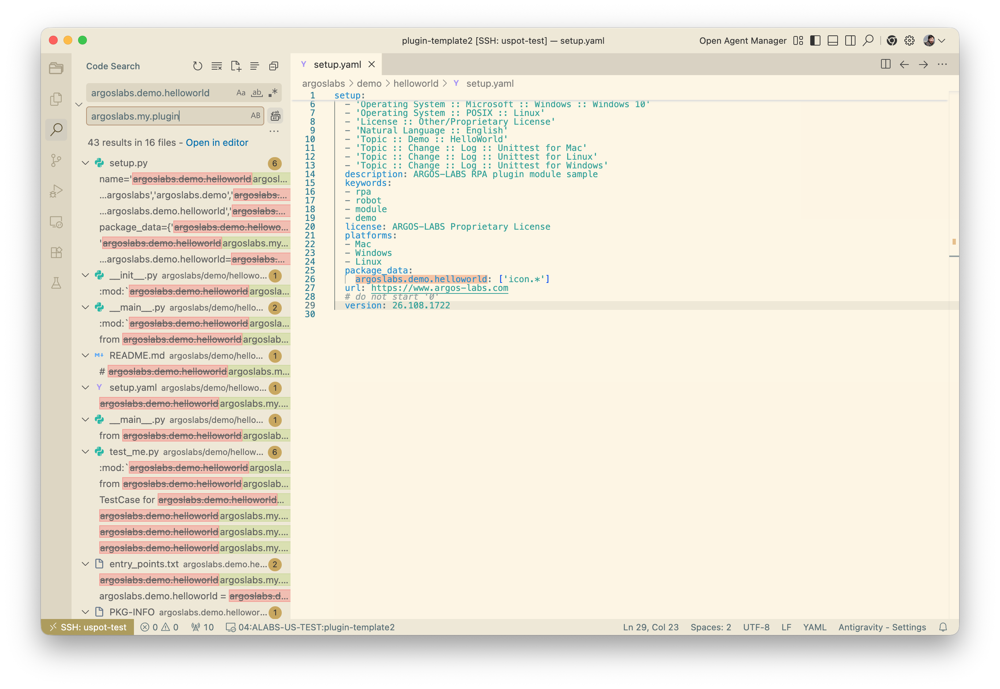

* Accordingly, you should also change the folder name from `demo` to `my` and `helloworld` to `plugin` in the `argoslabs/demo/helloworld` folder.
* The rest is the same.
