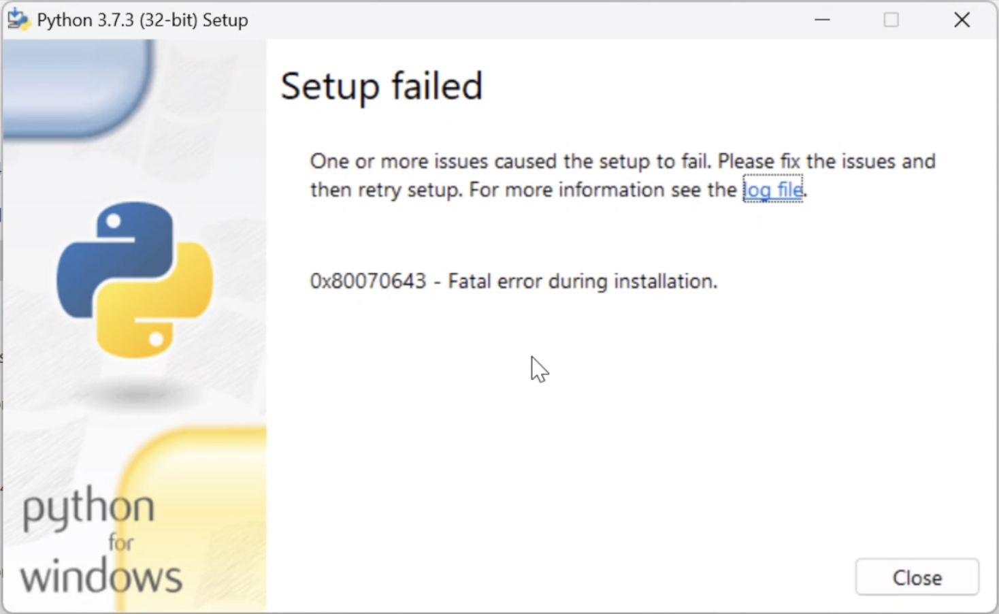
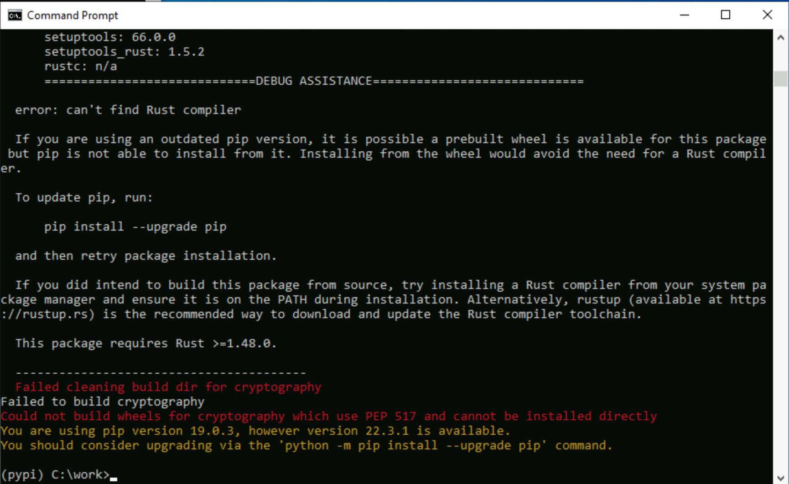
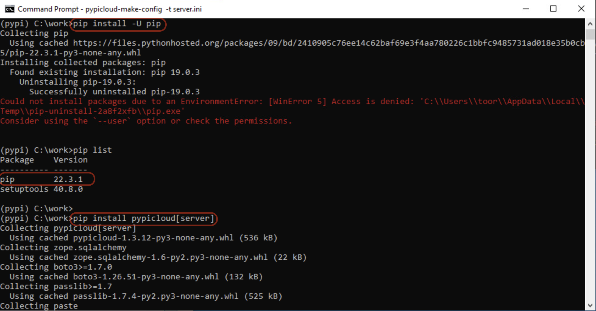
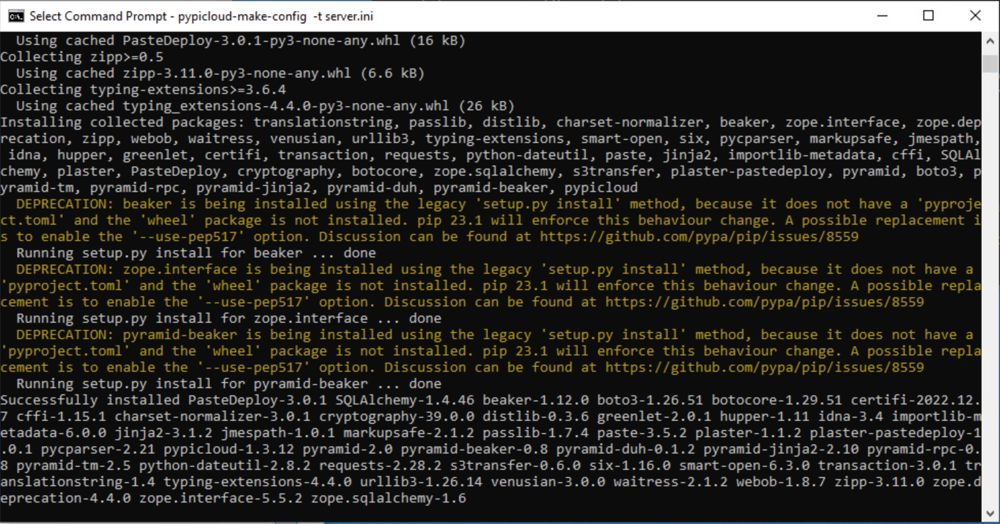

# POT SDK - Important Notes - Troubleshooting

> POT SDK setup can be very sensitive about the environment. 
> We strongly recommend you follow the instruction in the POTSDK document STEP-BY-STEP precisely to ensure the correct setup.

## Why we need to use Python 3.7.3?

Because of 2 reasons:
> 1. When POT SDK was built initially, V.3.7 was chosen as the most "supported" version in the Python community
> 2. then we have embedded Python interpreter in PAM (This will be updated peridically as Python EOLs older versions)


## When failed to install Python interpreter, please check below 

Sometimes if you get the error message, `0x80070643 - Fatal error during installation.`:



> Check to see if you have installed another version of Python from `Microsoft Store` or `Anaconda` installed.
> Uninstall preinstalled Python and then this problem will be solved.
> Or you can install directly from `Anaconda` environment.


## Could not install `pypicloud` for private repository

If you encounter next error: `Failed cleaning build dir for cryptography`


> This is because pip version is outdated. Please update pip as latest one. (Jan 2023)
> Run commands as follows:

```sh
(pypi) C:\work> pip install -U pip
(pypi) C:\work> pip install pypicloud[server]
```


Firstly upgrade pip and try to install again `pypicloud[server]`.



You can successfully install the `pypicloud[server]` python private repository.


## When you fail with build.bat, please check these items

> 1. `Build.bat` uses Virtual Evironment which must be dedicated to POT SDK
> 2. The Virtual Environment cannnot be modified like general Python venv. Files cannot be added or removed manually (or via CLI) because the files (especially the dependent Python modules) must be added by the ARGOS Low-code platform automatically to be syncronized with other components such as PAM.

